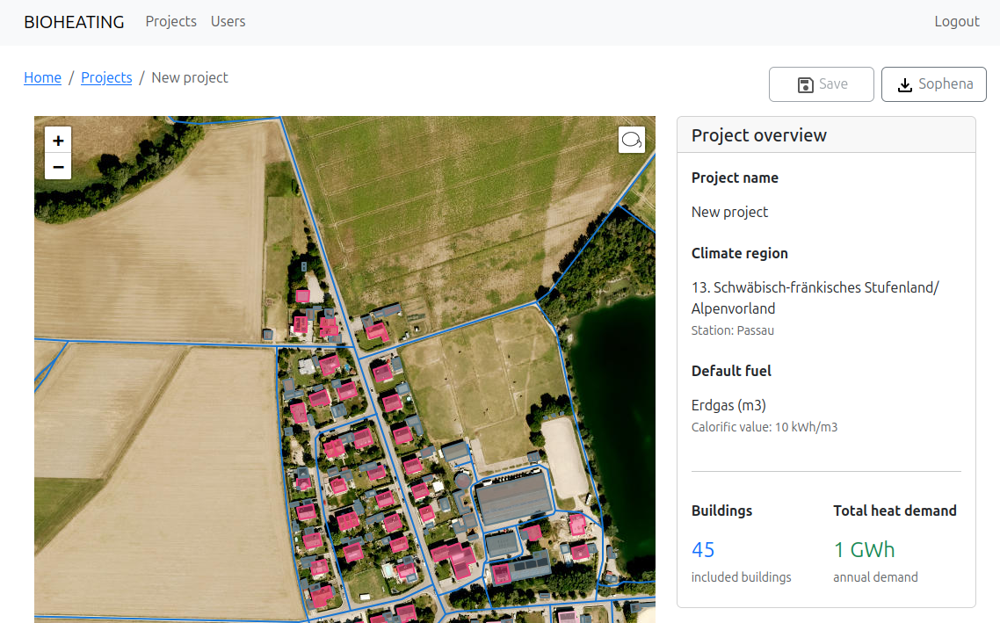

# The BioHeating Tool

This is the server application developed in the [BIOHEATING](https://biogas.fnr.de/projektfoerderung/ausgewaehlte-projekte/projekte/bioheating-tool-fuer-standortspezifische-waermekonzepte) project. It can be used to predict the heat demand for a set of buildings and for drafting a local heat net. A project created with this tool can be then exported to [Sophena](https://github.com/GreenDelta/Sophena) and further edited there. It has the following features (still under development):

+ CityGML import for building data
+ OSM import for street data
+ 1st model for heat demand predictions
+ UI with an interactive map for editing
+ Calculating and exporting the heat net layout




## Running from source

First, you need to create a Postgres database with the [database schema](./server/schema.sql) and settings as defined in the [application.properties](./server/src/main/resources/application.properties).

The back-end is a SpringBoot application and is located in the `server` folder. You can just run the `App` in your favourite IDE or from the command line:

```bash
cd server
mvn spring-boot:run
```

The user interface is built with TypeScript, React, and Webpack. The UI source code is located in the `ui/` directory:

```bash
cd ui
npm run dev
```

This runs `webpack watch` mode, which automatically rebuilds the UI when source files change and outputs the built files to `server/static/`.

For a production build:

```bash
cd ui
npm run build
```

This runs webpack in production mode and outputs the built files to `server/static/`.
